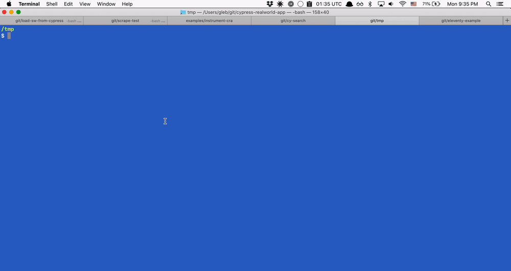

# cy-search [![ci status][ci image]][ci url]
> Search Cypress documentation from the terminal



## Use

```shell
$ npx cy-search
  - type search query
  - click on the result to open the browser
```

[ci image]: https://github.com/bahmutov/cy-search/workflows/ci/badge.svg?branch=main
[ci url]: https://github.com/bahmutov/cy-search/actions
